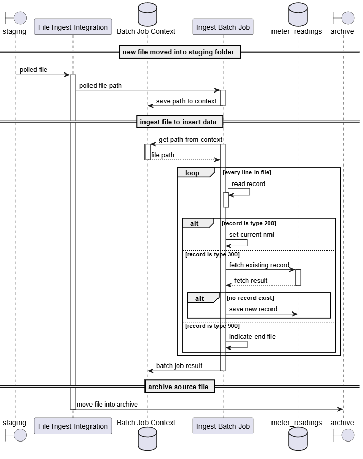

# nem12-ingest-batch-service

This repository is a simple Spring Batch + Spring Integration application to ingest .csv files of NEM12 specification.

## Assignment Writeup

A requirement by the **Flo Energy Tech Assessment 2025** mandated a writeup to justify the design choices made when implementing this application. The writeup.md file located [here](./writeup.md) contains the contents associated with this requirement.

## Dependencies

The application requires Java 21 to run. It uses Spring Boot 3 and is built via Maven.

## Building the application

To build the application, run the maven goals using ```mvn clean install```. To build without running the unit tests, specify ```-DskipTests``` when running the maven goals.

## Running the application

To run the built .jar file, navigate to the build directory ```target``` and run the .jar file with the ```java -jar``` command.

### Application configurations

The staging and archive directory must be specified. You can do this by specifying it along with the command to run the jar:

```--flo.nem12.ingest.staging.file-system-local.location=<your staging directory location>```

```--flo.nem12.ingest.archive.file-system-local.location=./<your archive directory location>```

if the directories are not specified, directories will be generated at ```./staging``` and ```./archive``` respectively. To turn off automatic directory genration, you can set the following properties to ```false``` by specifying it in the command to run the jar:

```--flo.nem12.ingest.staging.file-system-local.location.auto-create=<true/false>```

```--flo.nem12.ingest.archive.file-system-local.location.auto-create=<true/false>```

### Ingesting a file

The following diagram shows the general flow of execution for ingesting a .csv file:



To begin the ingestion process, simply place a copy fo the .csv file into the staging directory. Once ingestion is complete, the file will then be moved into the archive directory.

#### Spring Integration Component

The staging file is picked up via a polling process implemented using Spring Integration. The Spring Integration DSL configurations can be found in the ```FileSystemIntegrationConfiguration``` class.

#### Spring Batch Component

The ingesting process is implemented as a series of steps in the Ingest Job. The job configuration can be found in the ```IngestJobConfiguration``` class, while the steps' configurations can be found in the ```IngestInitStepConfiguration``` and ```IngestStepConfiguration``` classes.

#### Spring Batch Integration

In order for Spring Integration to start Spring Batch jobs, a transformer delegate is to be defined. This is defined in the ```JobIntegrationTransformer``` class.

### Verifying Results

You may verify results by querying the meter_readings table from the database.

Alternatively, you may call the following endpoints to query data:

```/flo/nem12``` gets all readings already commited into the database.

```/flo/nem12/nmi``` gets a list of NMI details (NMI, no. of records, start time, end time) that are present in the database.

```/flo/nem12/reading?nmi={nmi}``` gets the records associated with the NMI from the database.

```/flo/nem12/reading/range?nmi={nmi}&start={yyyyMMddHHmmss}&end={yyyyMMddHHmmss}``` gets the records in the given time range associated with the NMI from the database.

